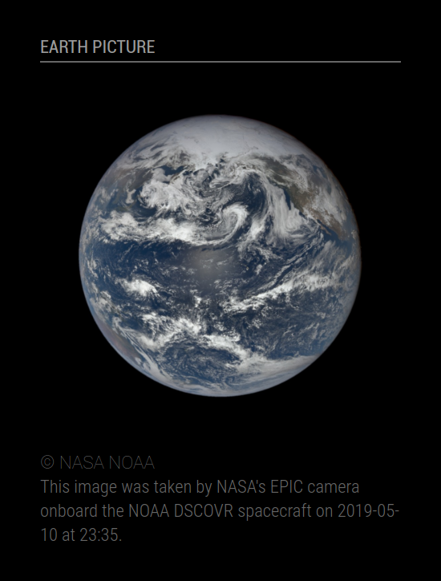
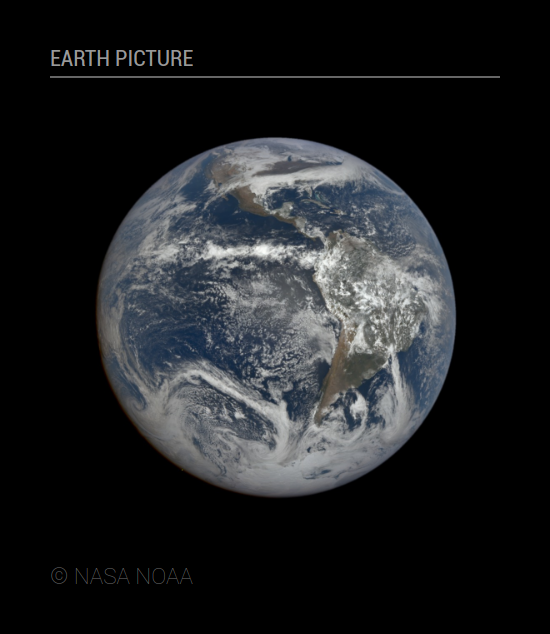

# Module: MMM-EPIC
This module displays the last Earth Polychromatic Imaging Camera (EPIC) image, including description and copyright.

The max-height and max-width of the media can be fixed. Description display may be enabled or disabled independently.

<p align="left">


</p>

[MagicMirror Project on Github](https://github.com/MichMich/MagicMirror) | [EPIC on NASA](https://epic.gsfc.nasa.gov/)

## Installation:

In your terminal, go to your MagicMirror's Module folder:
```shell
cd ~/MagicMirror/modules
```

Clone this repository:
```shell
git clone https://github.com/grenagit/MMM-EPIC
```

Configure the module in your config.js file.

## Update:

In your terminal, go to your MMM-EPIC's Module folder:
```shell
cd ~/MagicMirror/modules/MMM-EPIC
```

Incorporate changes from this repository:
```shell
git pull
```

## Configuration:

### Basic configuration

To use this module, add it to the modules array in the `config/config.js` file:
```javascript
modules: [
	{
		module: "MMM-EPIC",
		position: "top_left",
		config: {
			appid: "abcde12345abcde12345abcde12345ab" // NASA API key (api.nasa.gov)
		}
	}
]
```

You can use the special `DEMO_KEY` API Key for your tests but it has much lower rate limits !

### Options

The following properties can be configured:


| Option                       | Description
| ---------------------------- | -----------
| `appid`                      | The [NASA](https://api.nasa.gov) API key, which can be obtained by [signing up](https://api.nasa.gov/index.html#apply-for-an-api-key) on NASA API portal. It's free! <br><br>  This value is **REQUIRED**
| `updateInterval`             | How often does the content needs to be fetched? (Milliseconds) <br><br> **Possible values:** `1000` - `86400000` <br> **Default value:** `1 * 60 * 60 * 1000` (1 hour)
| `animationSpeed`             | Speed of the update animation. (Milliseconds) <br><br> **Possible values:**`0` - `5000` <br> **Default value:** `1000` (1 second)
| `maxMediaWidth`              | Maximum width for media display. If set to 0, the media's actual width is used. (Pixels) <br><br> **Possible values:**`0` - `5000` <br> **Default value:** `0` (media's width)
| `maxMediaHeight`             | Maximum height for media display. If set to 0, the media's actual height is used. (Pixels) <br><br> **Possible values:**`0` - `5000` <br> **Default value:** `0` (media's height)
| `showTitle`                  | Show the title. <br><br> **Possible values:** `true` or `false` <br> **Default value:** `true`
| `showDescription`            | Show the description. <br><br> **Possible values:** `true` or `false` <br> **Default value:** `false`
| `initialLoadDelay`           | The initial delay before loading. If you have multiple modules that use the same API key, you might want to delay one of the requests. (Milliseconds) <br><br> **Possible values:** `1000` - `5000` <br> **Default value:**  `0`
| `retryDelay`                 | The delay before retrying after a request failure. (Milliseconds) <br><br> **Possible values:** `1000` - `60000` <br> **Default value:**  `2500`
| `apiBase`                    | The NASA API base URL. <br><br> **Default value:**  `'https://api.nasa.gov/'`
| `epicDataEndpoint`           | The EPIC API endPoint for metadata of natural color imagery. <br><br> **Default value:**  `'EPIC/api/natural/images'`
| `epicImageEndpoint`          | The EPIC API endPoint for image file of natural color imagery. <br><br> **Default value:**  `'EPIC/archive/natural'`

### Todo

- [x] Add an error message if the rate limit is exceeded.

### License

This module is licensed under the MIT License
